<h1 align="center">🔮 Prism</h1>
<h3 align="center">The AI Assistant That Finally Explains Itself — Transparent, Bias-Free, Ethical Banking</h3>

  

<h2>🎯 The Problem</h2>

Banking AI makes life-changing decisions but rarely explains <i>why</i>. Customers face:

<ul>
  <li>Silent rejections with no explanation</li>
  <li>Hidden bias against women, elderly & minorities</li>
  <li>Language barriers for non-English speakers</li>
  <li>No control over data usage</li>
  <li>No transparency in automated processes</li>
</ul>

<b>Impact:</b> 72% of rejected borrowers never reapply; nearly half switch banks after unfair AI decisions.

<h2>💡 Our Solution</h2>

Prism is a <b>voice-powered, bias-free AI assistant</b> that explains every banking decision.

<ul>
  <li>🎤 5+ languages — ask anything naturally</li>
  <li>🔍 Clear “why” behind decisions</li>
  <li>🔒 Full data ownership and transparency</li>
</ul>

<h2>👥 Who We Serve</h2>
<ul>
  <li>✅ Women Entrepreneurs — fair access</li>
  <li>✅ Elderly Users — native-language banking</li>
  <li>✅ Underserved Communities — financial inclusion</li>
  <li>✅ Ethical Banks — transparency & trust</li>
</ul>

<h2>✨ Key Features</h2>
<ul>
  <li>🔍 <b>Visual Explainability</b> — SHAP dashboards showing decision factors</li>
  <li>⚖ <b>Bias-Free AI</b> — no gender/age/state/nationality inputs</li>
  <li>🎤 <b>Multilingual Voice Interface</b> — powered by Whisper</li>
  <li>🚨 <b>Real-Time Alerts</b> — fraud, unusual activity</li>
  <li>🔒 <b>Granular Data Control</b> — toggle + delete anytime</li>
  <li>🤖 <b>AI Chatbot Assistant</b> — answers and adjusts permissions</li>
  <li>📊 <b>Dual Audit Logs</b> — customer + regulator views</li>
  <li>🔄 <b>Continuous Learning</b> — fairness improves daily</li>
</ul>

<h2>🛠 Tech Stack</h2>
<ul>
  <li>🧠 XGBoost + SHAP — explainable ML</li>
  <li>🤖 Groq LLM — conversational banking assistant</li>
  <li>🎤 Whisper AI — 99+ language voice recognition</li>
  <li>⚛ React Native — cross-platform UI</li>
  <li>🟢 Node.js + Express — secure backend</li>
  <li>🐘 PostgreSQL — bank-grade data storage</li>
</ul>

<h2>🖼 Screenshots</h2>

  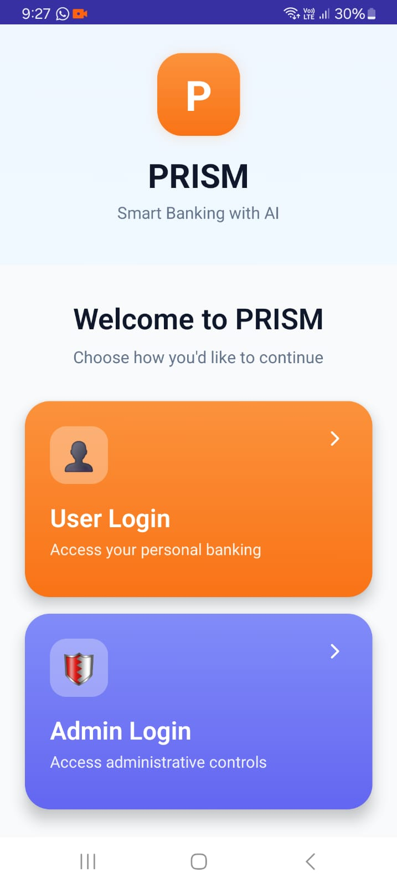
  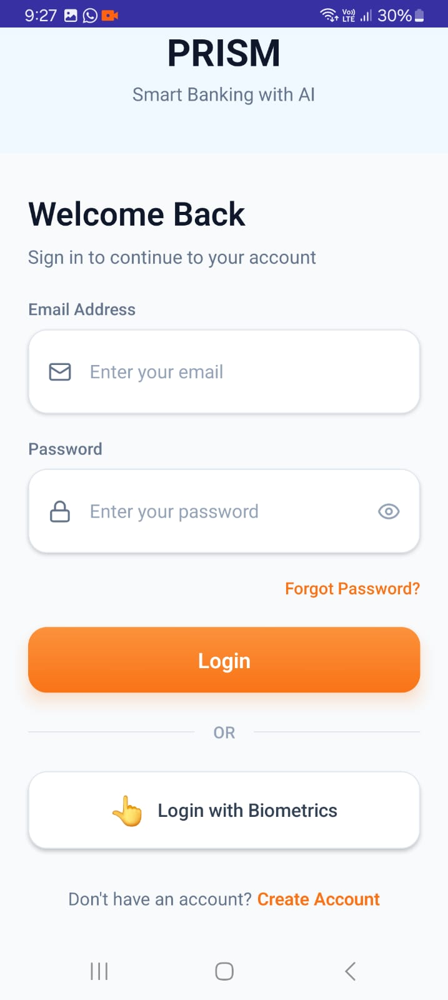
  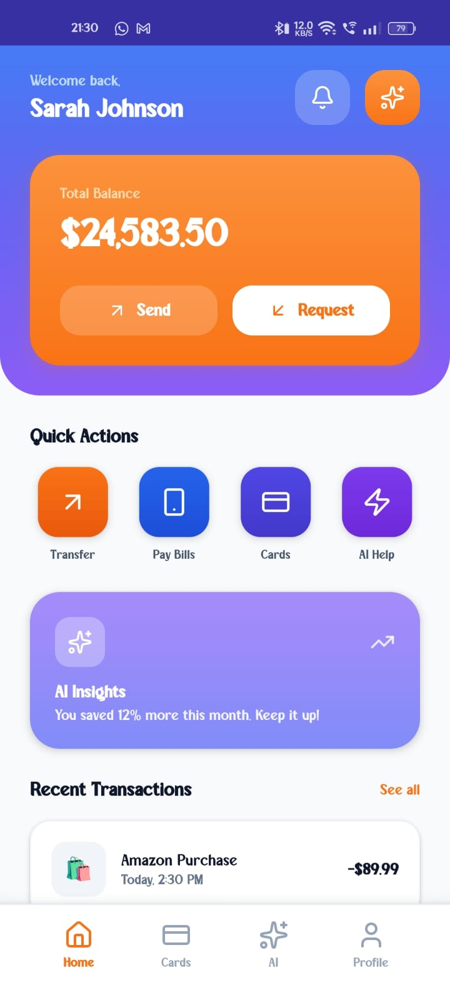
  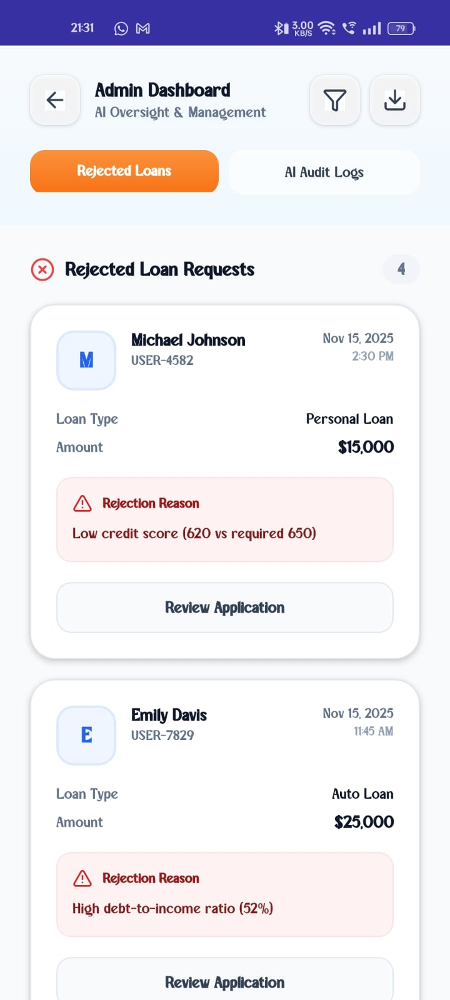
  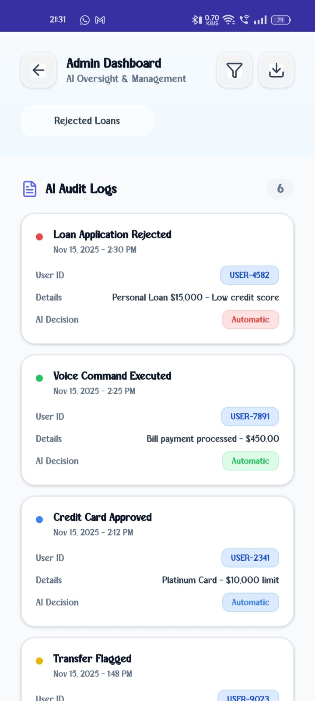
  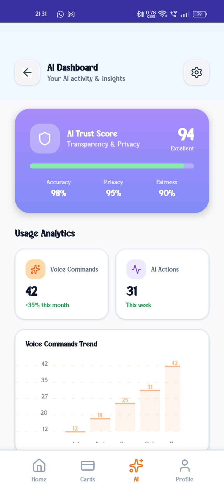

  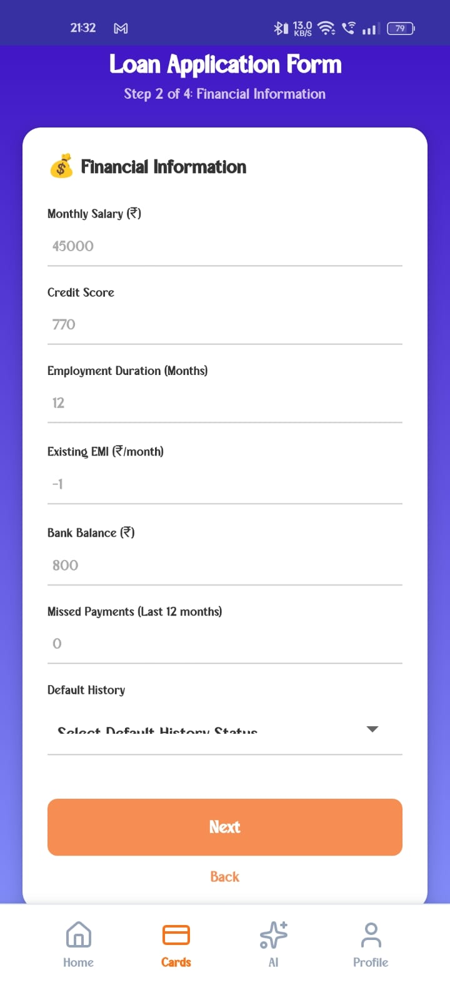
  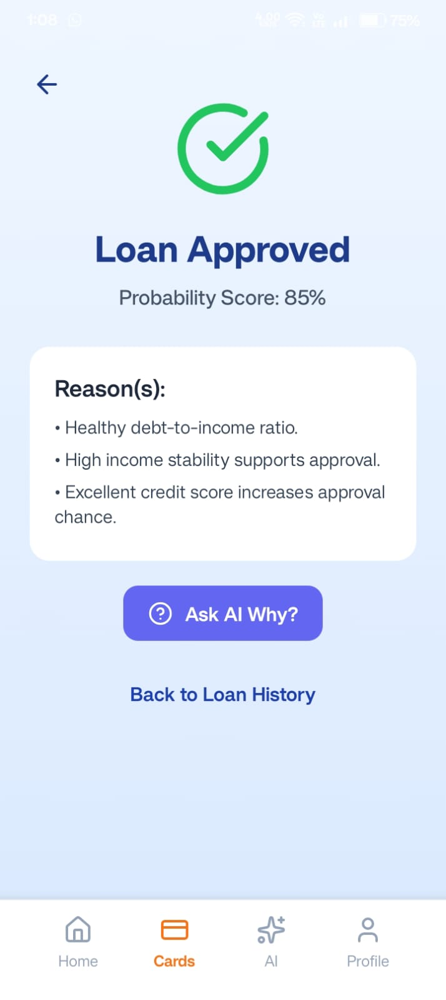
  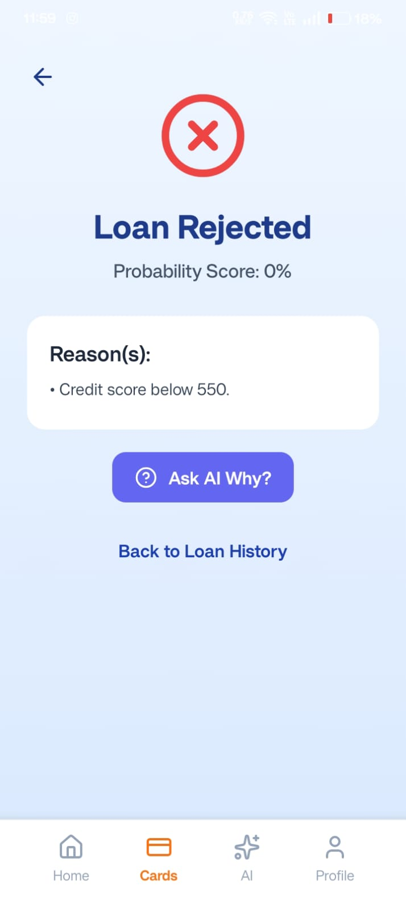
  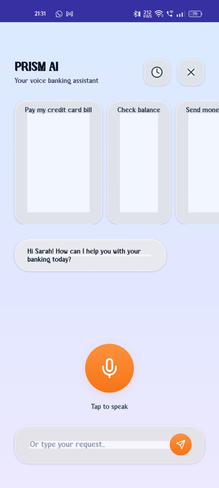
  
  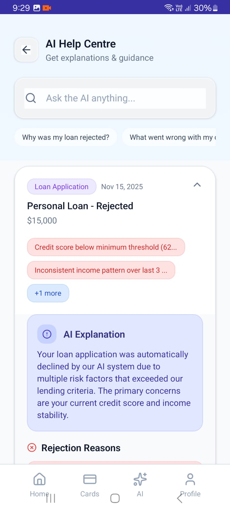

<h2>📫 Contact</h2>

Team Prism 
  📧 harirajan10192005@gmail.com 
  📧 deepikaanandhan2@gmail.com 
  📧 a.agila2005@gmail.com 
  📧 dhaneshprabhupro@gmail.com 

