<div align="center">


### *The AI Assistant That Finally Explains Itself*


[](https://reactnative.dev/)
[](https://nodejs.org/)
[](https://postgresql.org/)
[](https://xgboost.ai/)

**[🎥 Watch Demo](https://www.youtube.com/watch?v=eptXI1YSp4U) • [🚀 Try Colab](https://colab.research.google.com/drive/1hp4hwmMiUQIhy5Sj7IhmDGTmrU1jt21S) • [📧 Contact Us](#-contact)**

</div>

---

## 🎯 **The Problem**

<p align="center">
  
  <br/>
  <i style="font-size:18px;">Getting rejected without an explanation hurts the most.</i>
</p>


Nowadays Banking AI makes life-changing decisions—loan approvals, credit limits, account access—but **never explains why**. Millions face:

<table>
<tr>
<td width="50%">

**💔 The Reality**
- Silent rejections with no path forward
- Hidden bias affecting women & minorities
- Language barriers exclude elderly users
- Zero control over data usage
- No transparency in decisions

</td>
<td width="50%">

**📊 The Numbers**
- **35%** lower approval rates for women
- **72%** of rejected borrowers never reapply
- **Nearly half** switch banks after unfair AI
- **30 days** of silence after rejection

</td>
</tr>
</table>
> *"When a machine decides your future in seconds, shouldn't it at least tell you why?"*
---

## 💡 **Meet Prism**

**Voice-powered AI that explains every decision instantly, eliminates bias, and gives you complete control over your data.**

<div align="center">

| ❌ Traditional Banking AI | ✅ Prism |
|:---|:---|
| Black box decisions | Every decision explained instantly |
| English-only | 99+ languages via voice |
| Hidden bias | Real-time bias detection |
| No data control | Granular toggle-based permissions |
| Silent rejections | Actionable improvement roadmaps |

</div>


**Prism: Turning complexity into clarity.**

---

## 👥 **Who We Serve**

<div align="center">

| 💼 Women Entrepreneurs | 👴 Elderly Users | 🌍 Underserved Communities | 🏦 Ethical Banks |
|:---:|:---:|:---:|:---:|
| Fair access without gender bias | Banking in native language | Financial inclusion for all | Build trust through transparency |

</div>

---

## ✨ **Why Prism Wins**

<table>
<tr>
<td width="50%">

### 🔍 **Explainable AI**
- **Visual SHAP dashboards** show decision factors
- **2-second explanations** replace 30-day silence
- **Natural language** breakdowns anyone can understand

### ⚖️ **Bias-Free by Design**
- **Never uses** gender, age, state, nationality
- **AIF360 firewall** scrubs bias before inference
- **Continuous learning** from user feedback

### 🎤 **Voice-First Experience**
- **99+ languages** with Whisper AI
- **Conversational chatbot** answers unlimited questions
- **Agentic automation** adjusts permissions instantly

</td>
<td width="50%">

### 🔒 **Zero-Trust Security**
- **JWT-powered authentication** with RBAC
- **Dual audit logs** (customer + regulator)
- **OTP verification** + end-to-end encryption

### 📊 **Governance Dashboard**
- **Human-in-the-loop** override capability
- **Immutable audit trails** with crypto linking
- **Real-time alerts** for fraud & unusual activity

### 🔄 **Continuous Improvement**
- **Feedback loop** retrains models quarterly
- **Granular data control** with simple toggles
- **Privacy by design** with instant deletion

</td>
</tr>
</table>

---

## 🛠️ **Tech Stack**

```mermaid
graph TB
    A[🎤 User Voice Input] --> B[Whisper AI<br/>5+ Languages]
    B --> C[Node.js API Gateway<br/>JWT + RBAC]
    C --> D[XGBoost + SHAP<br/>ML Engine]
    C --> E[Groq LLM<br/>Chatbot]
    C --> F[AIF360<br/>Bias Firewall]
    D --> G[(PostgreSQL<br/>Structured Data)]
    D --> H[(MongoDB<br/>Voice Logs)]
    D --> I[Redis Cache<br/>SHAP Explanations]
    E --> G
    F --> D
    G --> J[React Native<br/>iOS + Android]
    J --> A
```

<div align="center">



</div>

<table align="center">
<tr>
<td align="center" width="33%">

### 🧠 **AI/ML Layer**
**XGBoost** - 91% accuracy predictions  
**SHAP** - <500ms explanations  
**AIF360** - Real-time bias detection  
**Whisper** - 99-language speech  
**Groq LLM** - Conversational assistant

</td>
<td align="center" width="33%">

### ⚙️ **Backend**
**Node.js + Express** - Scalable API  
**PostgreSQL** - Row-level security  
**MongoDB** - Unstructured logs  
**Redis** - 80% cache hit rate  
**AWS S3** - Document storage

</td>
<td align="center" width="34%">

### 📱 **Frontend**
**React Native** - Cross-platform  
**JWT Auth** - Secure sessions  
**Voice UI** - Hands-free banking  
**Real-time** - WebSocket updates  
**Responsive** - Works everywhere

</td>
</tr>
</table>

---

## 🚀 **Quick Start**

### **Try the ML Model (No Setup Required)**

1. **Open Colab Notebook**  
   👉 [https://colab.research.google.com/drive/1hp4hwmMiUQIhy5Sj7IhmDGTmrU1jt21S](https://colab.research.google.com/drive/1hp4hwmMiUQIhy5Sj7IhmDGTmrU1jt21S)

2. **Run All Cells** (`Runtime → Run all`)

3. **Test Predictions** in Cell 3:
   ```python
   # Customize customer details
   age = 35
   salary = 60000
   credit_score = 720
   loan_amount = 25000
   # ... and see instant SHAP explanations!
   ```

4. **Ask Prism Questions** in Cell 10:
   ```python
   "Why was I rejected?"
   "How can I improve my chances?"
   "What factors matter most?"
   ```

---

## 📊 **The Impact**

<div align="center">

### **Real Benefits, Real People**

```
✅ Bias detected and stopped before causing harm
✅ Rejected users get clear paths to approval
✅ Transparency builds trust and customer loyalty
✅ 2-second explanations replace 30-day silence
```

### **Social Impact**

| 💼 Women entrepreneurs get fair access | 👴 Elderly users bank in their language |
|:---:|:---:|

</div>

---

## 🖼️ **Prism in Action**

<div align="center">

### **Model Outputs & Explanations**

<table>
<tr>
<td></td>
<td></td>
<td></td>
<td></td>
</tr>
</table>

### **User Interface**

<table>
<tr>
<td></td>
<td></td>
<td></td>
<td></td>
</tr>
<tr>
<td></td>
<td></td>
<td></td>
<td></td>
</tr>
<tr>
<td></td>
<td></td>
<td></td>
<td></td>
</tr>
</table>

</div>

---

## 🎥 **Video Demo**

<div align="center">

[](https://www.youtube.com/watch?v=eptXI1YSp4U)

**[▶️ Watch Full Demo on YouTube](https://www.youtube.com/watch?v=eptXI1YSp4U)**

</div>

---

## 🏆 **Built For**

<div align="center">

**Hackathon Theme:** *Ethical AI in Banking - Building Trust & Transparency*

Addressing: AI Transparency • Explainability • Customer Control • Responsible Governance • Fairness & Bias Reduction

</div>

---

## 📧 **Contact**

<div align="center">

**Team Prism** 🔮

[](mailto:harirajan10192005@gmail.com)
[](mailto:deepikaanandhan2@gmail.com)
[](mailto:a.agila2005@gmail.com)
[](mailto:dhaneshprabhupro@gmail.com)

---

### **Be on TOP with PRISM **

*"Banking transparency, finally."*

</div>

---

<div align="center">

Made with 💜 by Team Prism | MIT License

</div>
